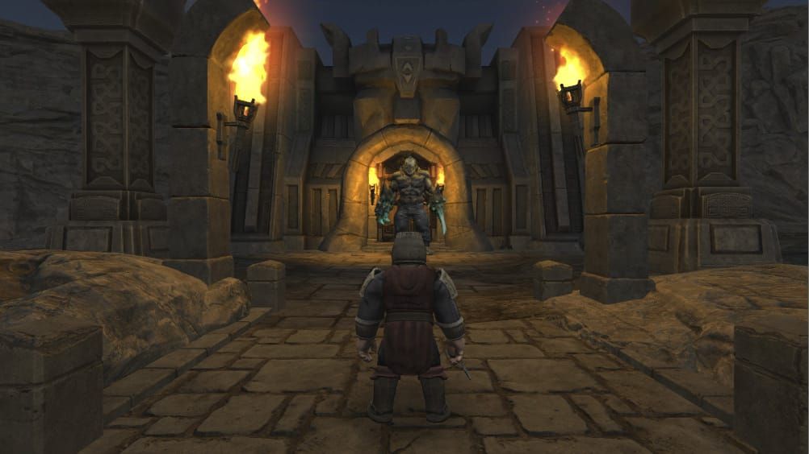
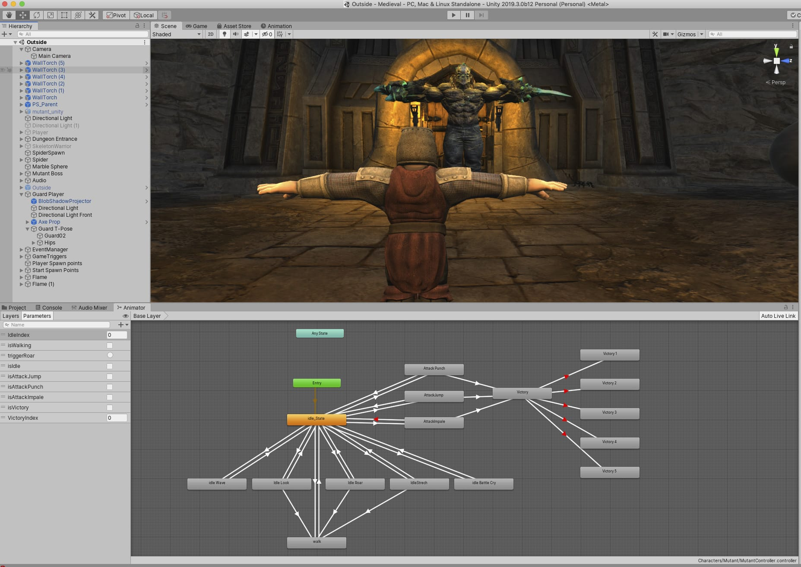

# Medieval game

A dungeon and dragon style game

  - Unity 5.6 C#

# Features!

  - Finite State Machine
  - Boss and Player have multiple animations
  - Follow Camera using Ridgid Body physics and Sphere Collider.

# Todo

  - Gameplay
  - Boss AI and attack moves.
  - Menu system
  - Inventory system

# unity Package
  contact me, for working demo.

# Screenshots

